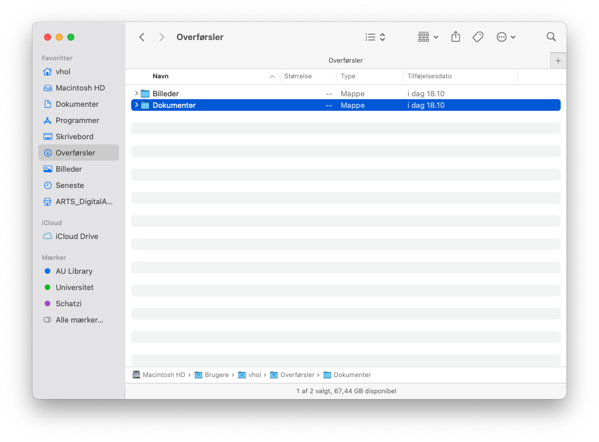
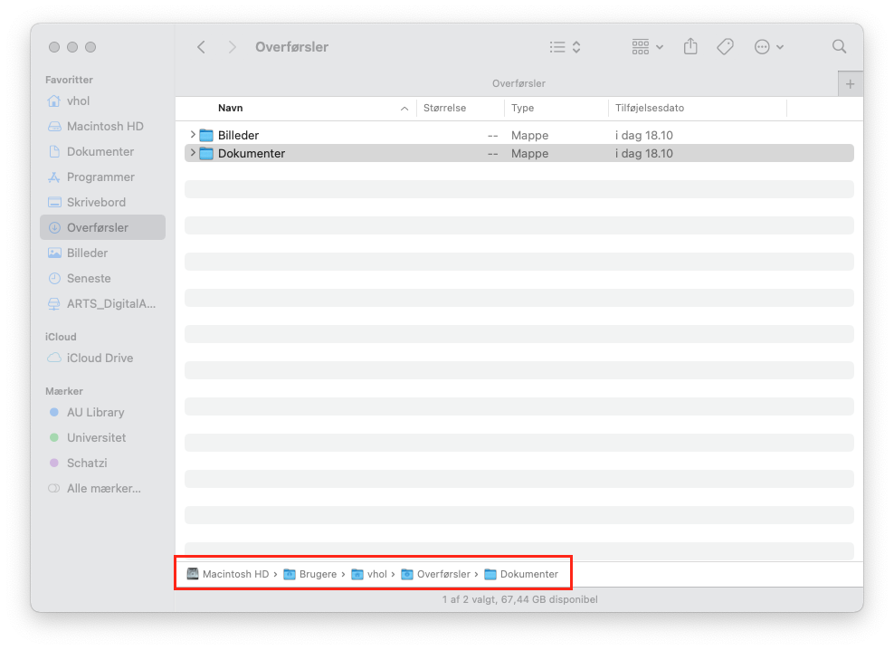
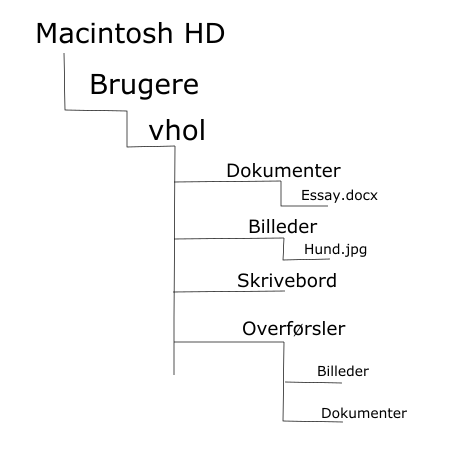
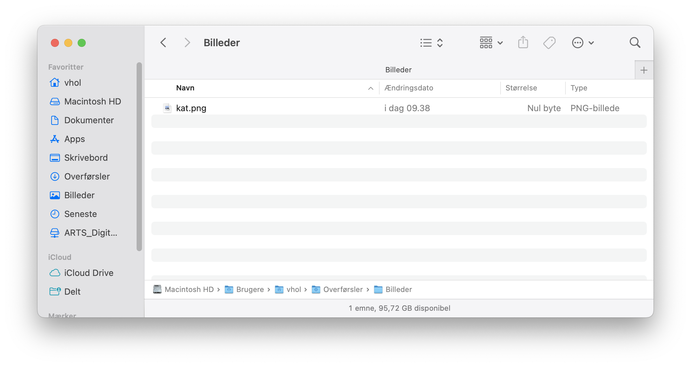

# Hvad er filstier/paths?
Uanset hvilket styresystem du har installeret på din computer er alt data gemt som filer. En fil kan være mange forskellige ting, det kan eksempelvis være videofiler, billedefiler eller tekstfiler. Det kan groft sagt være alle typer af data. For at organisere filerne bruger vi mapper. Mapper er steder vi kan organisere vores filer, præcis som med en fysisk mappe. Filer og mapper har alle navne. Filers navne har grundlæggende to funktioner: De skal både gøre det mulig for dig at vide hvad filen handler om, men fil navnet skal også fortælle computeren, hvad det er for en type fil og hvad den skal gøre med denne fil. Man vil i arbejdet med computeren stødde på mange forskellige fil endelser, som alle fortæller computeren, hvordan den skal håndtere filerne. Det kunne f.eks være nogle af disse, som du nok har set nogle af før:

|Lyd|Video|Billeder|Dokumenter|Andet|
|---|---|---|---|---|
|.MP3|.MP4|.JPG|.DOCX|.ZIP|
|.WAV|.MOV|.PNG|.PPTX|.EXE|
|.WMA|.AVI|.GIF|.PDF|.DMG|

Hvordan finder vi rundt i alle disse filer og mapper? Typisk vil du klikke dig rundt på computeren ved hjælp af din mus og den grafiske visning af dine mapper, som måske er placeret på dit skrivebord eller i en anden mappe på din computer. Allerede her bliver det mere kringlet, for mapper kan være placeret inden i andre mapper. På billedet nedenfor ses det hvordan der i mappen *Overførsler* findes to andre mapper: *Billeder* og *Dokumenter*. 

Du ved nu, at mapper kan eksistere inden i andre mapper. For at være sikker på at man finder den rigtige mappe, kan man skrive mappers navne som stier(Engelsk: paths). På billedet nedenfor ser man den fulde sti hen til mappen *Overførsler*.

På billedet ovenfor er mapperne på stien adskilt med en lille pil. Hvis man vil skrive stien korrekt på en mac skrives den på følgende måde: 'Macintosh HD/Brugere/vhol/Overførsler'. Havde det istedet været en Windows computer skulle stien være skrevet således: 'Macintosh HD\Brugere\vhol\Overførsler'.

Når du skal arbejde med dine filer i computerprogrammer som fx R eller Python er det afgørende at vide, hvordan man finder hen til sine filer ved at bruge stier. Kodesprog som R eller Python ser ikke computeren som os mennesker. Disse sprog ser ingen grafiske mapper og har ingen mus at klikke sig igennem computeren med. Programmerne ser istedet computere som en stor samling a stier, der alle udspringer fra en bestemt rod: Computerens *rodmappe (Root directory)*. Hvis vi tager eksemplet ovenfra kan stisystemet på computeren visualiseres på følgende måde:

På denne model er *rodmappen* placeringen *Macintosh HD*. Du kan yderligere se, at der her findes en mappe der hedder *Brugere* og inden i denne mappes mappen *vhol*. Hvis man går ned i denne mappe finder man mapperne *Dokumenter*, *Billeder*, *Skrivebord* og *Overførsler*. Endeligt kan du se, at der i mappen *Dokumenter* er et dokument der hedder *Essay.docx*, mens der i mappen *Billeder* ligger et billede med navnet *Hund.jpg*. I mappen *Overførsler* finder vi de to mapper, som vi har set på de første to billeder.

Du ved nu, at man kan fortælle computeren præcist hvilken mappe eller fil den skal kigge efter ved at angive en sti. Når vi angiver en mappe eller fils sti kan det gøres på to måder. Der findes både absolutte og relative stier. Tænk på det, som to forskellige måder at finde frem til en adresse på. Den absolutte sti, er stedets specifikke adresse, mens den relative sti er den måde du ville forklare nogle der spurgte om vej, hvordan de kommer frem til deres destination:

Absolut sti|Relativ sti
:---------:|:---------:
AU Library, Nobelparken   Jens Chr. Skous Vej 5   8000 Aarhus C|Fra hvor du står nu   skal du gå til venstre i krydset  for derefter at dreje til venstre  om cirka 500 meter.  

På billedet ovenfor er forholdet mellem absolutte og relative stier skitseret. Den absolutte sti er den eksakte placering for en fil på din computer. Den absolutte sti kan være god at kende, men den er ofte lang at skrive. Den relative sti, beskriver en fils placering i forhold til, hvor du befinder dig på din computer lige nu. Lad os tage et eksempel: Du befinder dig i mappen *Overførsler* og vil gerne navigere hen til den fil, der hedder *kat.png*, som findes i mappen *Billeder* i mappen *Overførsler*.

Nuværende placering|Fil vi vil finde
:-------------------------:|:-------------------------:
  |  

Denne opgave kan gribes an på to måder. Du kan både bruge filens absolutte sti, men også dens relative sti. Hvis du vil skrive filen *kat.png*s placering med dens absolutte sti, ville du skulle skrive følgende: 'Macintosh HD/Brugere/vhol/Overførsler/Billeder/kat.png'. Hvis du derimod bruger dens relative sti, skal du kun skrive: 'Billeder/kat.png'. Dette skyldes at du allerede er i mappen *Overførsler* og derfor kan fortælle din computer at den ud fra dens nuværende placering skal finde mapppen *Billeder* og i den mappe skal den finde filen *kat.png*.

Du ved nu, at filer og mapper på din computer ikke kun kan findes ved at pege på dem med din mus. Det er også muligt at bruge deres stier. En mappe eller en fil har både en absolut sti og en relativ sti. Forskellen på de to viser sig i at den absolutte sti er HELE stien til filen, mens den relative sti tager udgangspunkt i din nuværende placering på computeren og finder vej derfra.